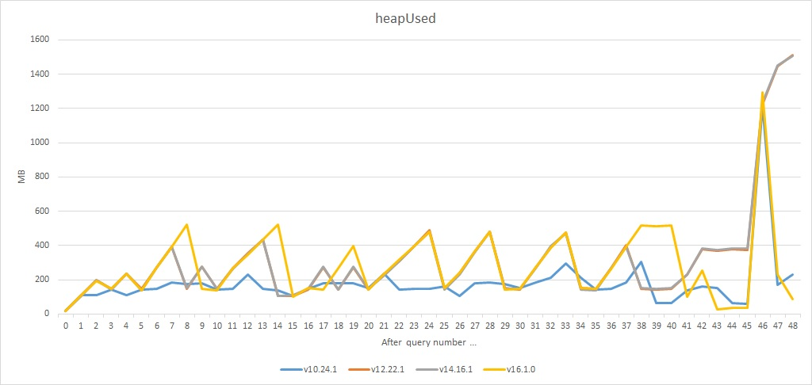
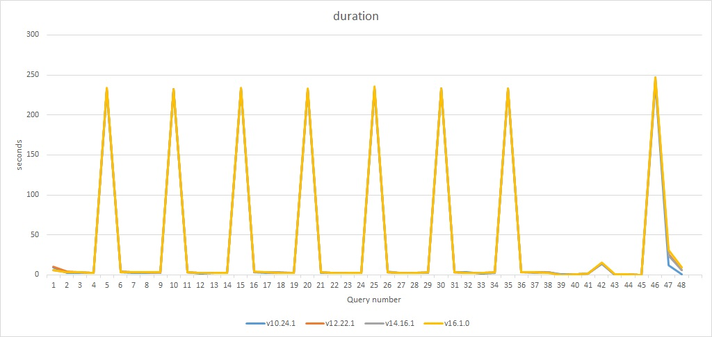

# Observations

Most observations can be verified in index.log commited on corresponding date.

## 2020-05-06
Additional loggings with Comunica logging, on request:
- index-logc-debug-1.log, index-logc-debug-2.log: two runs (giving different results), run with commandline `NODE_ENV=production node ./index.js --log verbose 2>&1 | tee <logfile>.log`.
- index-logc-debug-3-not-lenient.log: third run with same commandline as above, but code modified to set Comunica's lenient option `false`.

Observations:
- (1) Following differences in output data between first and second run:
  - in first run, `"id": "https://ben.de-meester.org/#me"` is missing from the output of query 30/48.
  - in second run, `"id": "https://ben.de-meester.org/#me"` is missing from the output of query 10/48.
  - in second run, `"id": "https://hvdsomp.info/#i"` is missing from the output of query 47/48.
- (2) Multiple occurrences of `ERROR: socket hang up` in first and second run, not immediately correlated to the missing output given above.
- (3) One occurrence of `ERROR: connect ETIMEDOUT 68.65.123.238:443` in second run, during query 47/48.
- (4) Interesting stacktrace when app ends in third run (Comunica not in lenient mode):
  ```
  (node:2896) UnhandledPromiseRejectionWarning: Error: socket hang up
  at connResetException (internal/errors.js:607:14)
  at TLSSocket.socketOnEnd (_http_client.js:493:23)
  at TLSSocket.emit (events.js:327:22)
  at endReadableNT (internal/streams/readable.js:1327:12)
  at processTicksAndRejections (internal/process/task_queues.js:80:21)
  (Use `node --trace-warnings ...` to show where the warning was created)
  (node:2896) UnhandledPromiseRejectionWarning: Unhandled promise rejection. This error originated either by throwing inside of an async function without a catch block, or by rejecting a promise which was not handled with .catch(). To terminate the node process on unhandled promise rejection, use the CLI flag `--unhandled-rejections=strict` (see https://nodejs.org/api/cli.html#cli_unhandled_rejections_mode). (rejection id: 33264)
  (node:2896) [DEP0018] DeprecationWarning: Unhandled promise rejections are deprecated. In the future, promise rejections that are not handled will terminate the Node.js process with a non-zero exit code.
  ```
  
  
## 2021-05-05
All previous observations were based on running this app with node v14.16.1.
Today, repeated with all latest node lts versions vxx.yy.z (xx = 10, 12, 14 and 16).
Saved each logging output separately in **index-vxx-yy-z.log** files.
See those log files for detailed differences.

### Overviews
Next overview diagrams were derived from the log files.

For interpretation, it is interesting to know (see also knows-query-data.js) that:
- Queries 1-38 ar for routes /education/master-thesis/{year}/{slug} (10 datasources)
- Query 46 is for route /education/master-theses (10 datasources, same as for queries 1-38)
- Query 47 is for route /teams (26 datasources)

#### Heap used



#### Query duration


### Conclusions
- (1) Heap usage differences per node version are very different, but the peak value is comparable (1300 vs 1500 MB roughly). Perhaps only due to different garbage collector behaviour...
- (2) Execution time differences per node version are neglectible.

## 2021-05-04
- (1) Calling v8.writeHeapSnapshot() after first query, results in premature node exit, even without error message. Last lines of (verbose) logging output:
  ```
  info: Memory usage after handling query 1/48: 
        rss 255.07 MB
        heapTotal 135.85 MB
        heapUsed 108.06 MB
        external 1.9 MB
        arrayBuffers 0.46 MB
  info: Started writing heap snapshot to file heap-1.heapsnapshot
  ```
- (2) Confirmation of all observations of 2021-04-29, even when adding `NODE_ENV=production` in front of the node command line.
  It is very remarkable that exactly the same queries have excessive execution times (> 230 seconds).
- (3) Differences in output data for 2 master theses: `contactPoint` concerning `https://ben.de-meester.org/#me` (compared with previously committed index.log)

## 2021-05-03
- (1) First commit today: remarkable difference with observations (2) and (3) of 2021-04-29:
  - Suddenly total duration now 167 seconds, no excessive individual query execution times!
- (2) Second commit today: observations (2) and (3) again in line with those of 2021-04-29.
  - Due to behaviour of datasources??? or network???

## 2021-04-29
- (1) Big memory usage (up to 1600 MB)
- (2) Runs slow (over 2000 seconds to fetch all KNoWS data)
  - Mind the individual query execution times. Following ones have excessive execution times (> 230 seconds), compared to others (a few seconds):
    5/48, 10/48, 15/48, 20/48, 25/48, 30/48, 35/48, 46/48
- (3) It takes about 4 minutes between final log message ("Ending app...") and node application exit
